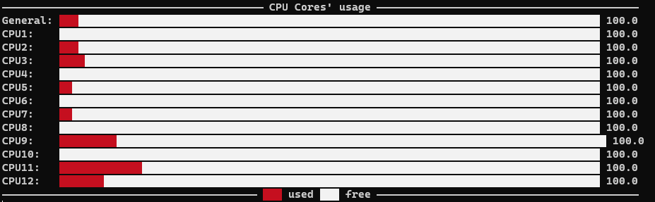

<h1 align=center> <ins>FluidStat</ins> 📺 </h1>

Fluidstat is a minimalist, WIP used ressources displayer. It's directly built in terminal. 

****

### CPU Usage

To display your CPUs load, `cd` in the project and run 
```py
python3 plot.py -cpu
```



****

### RAM Usage 

To display your ram usage, `cd` in the project and run 
```py
python3 plot.py -ram
```
