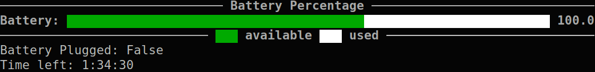

<h1 align=center> <ins>FluidStat</ins> 📺 </h1>

<span style="background-image: linear-gradient(to right, #F121cc, #8A2387cc); border-radius: 6px; padding: 0.2px 2px;">Fluidstat</span> is a minimalist, WIP terminal app that displays used ressources info. 

* [Features](#features)
    * [CPU Usage](#cpu-usage)
    * [RAM Usage](#ram-usage)
    * [Battery Usage](#battery-usage)
* [FluidStat as a command](#adding-fluidstat-as-a-command)
* [Extra Notes](#extra-note)


****
## Features
### CPU Usage
To display your CPUs load, `cd` in the project and run 
```py
python3 plot.py -cpu
```


****

### RAM Usage 
To display your ram usage, `cd` in the project and run 
```py
python3 plot.py -ram
```


### Battery Usage
To display your battery percentage, `cd` in the project and run 
```py
python3 plot.py -btry
```

> [!IMPORTANT] 
> This is only available when you have a battery. 

## Adding FluidStat as a command
If you wish to have FluidStat available as a global command in your Linux terminal, you can follow these steps:
1) You need to access the `bin/` folder located at the root of your system (`~/bin`) 
2) Once your are there, create a new file:
    ```bash
    sudo touch FluidStat
    ```
    > You need sudo as you are in the system files
3) You then have to add this content to it:
    ```bash
    python3 /../../home/USER/PATH_TO_PROJECT/FluidStat/plot.py $1
    ```
    > Where `USER` is your Linux username and `PATH_TO_PROJECT` the path to where you installed the project

    > You may need to use `sudo vim FluidStat` or `sudo nano FluidStat`

4) Give the autorisation to execute the file:
    ```bash
    sudo chmod +x FluidStat
    ```

5) You should now be able to launch the command from anywhere:
    ```bash
    FluidStat -cpu
    FluidStat -ram
    FluidStat -btry
    ```

## Extra Note
> [!IMPORTANT] 
> This project is WIP, the initial idea was to built a full desktop app using `fbs`, `PySide6`, ...
> As current state can tell, this is only a funny little project on which I don't plan on working anymore. The code is therefore really simple and basic. 